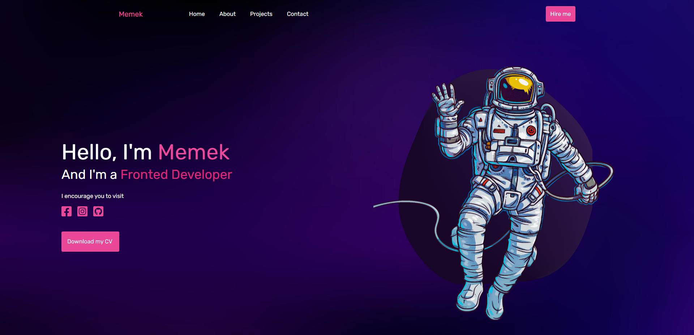
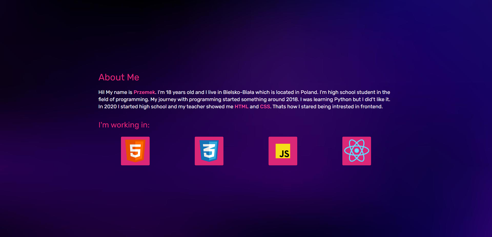
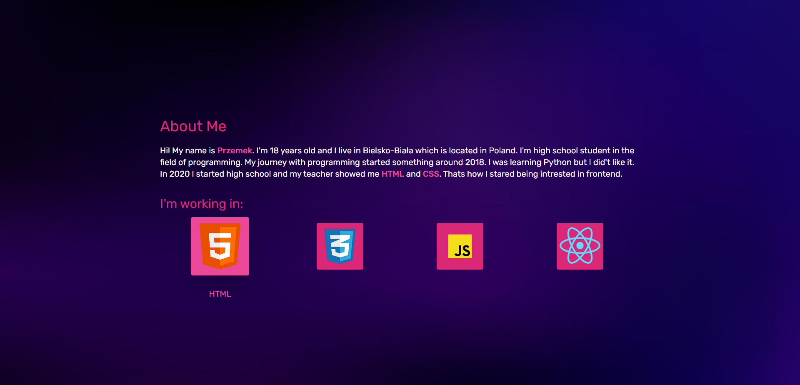
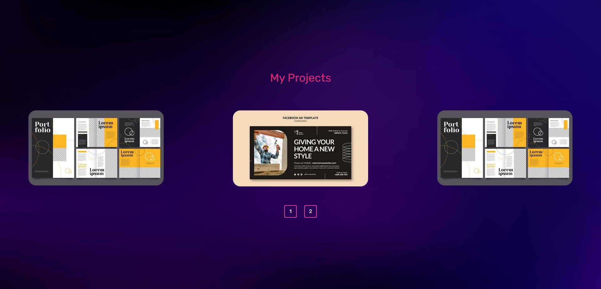
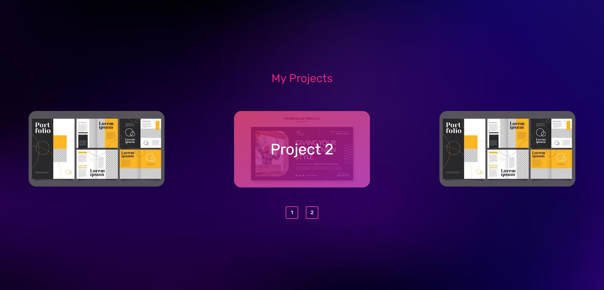
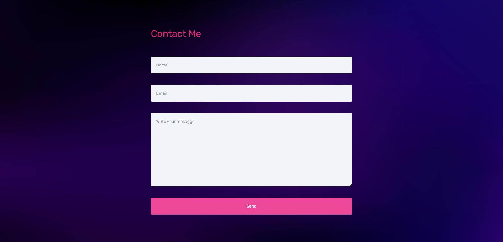

# Portfolio

## Autor: Przemysław Batelt

# Opis:

Projekt ten jest Portfolio, w którym będę umieszczał swoje projekty. 
Strona ta podzielona jest na 4 sekcje składające się z wielu komponentów. 
Do stworzenia tego projektu wykorzystałem ReactJS oraz bibliotekę Threee.js, która służy do tworzenia grafiki 3D. 
Wykorzystałem kilka pomysłów z filmu na YouTube do którego link jest [tutaj](https://www.youtube.com/watch?v=qALsVa-V9qo&list=LL&index=2&t=3380s&ab_channel=LamaDev). 
Największą trudnością dla mnie okazało się samo stworzenie układu strony oraz co może dziwić to nazywanie poszczególnych zmiennych 😀. 
Projekt na ten moment jest skończony ale w przyszłości gdy poznam bardziej zaawansowane technologie zamierzam dodać jeszcze trochę efektów wizualnych. 

# Galeria:

